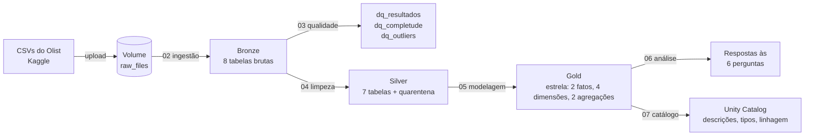
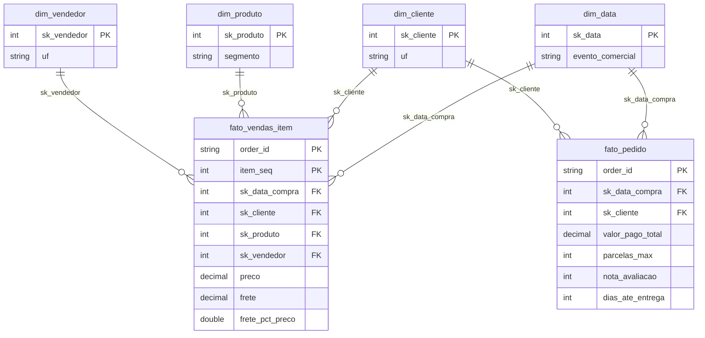

# Demanda de moda no e-commerce sob a ótica de mídia paga: pipeline de dados em Lakehouse

MVP de Engenharia de Dados construído no **Databricks Free Edition** (Unity Catalog, Delta Lake, PySpark e SQL), com arquitetura **Medalhão** (Bronze → Silver → Gold) e modelagem em **Esquema Estrela**.

* **Autora:** MILCA GOMES COUTINHO
* **Disciplina / turma:** Engenharia de Dados (40530010057_20260_01)
* **Plataforma:** Databricks Free Edition (computação serverless)
* **Dataset:** Brazilian E-Commerce Public Dataset by Olist (Kaggle)

## Sumário

1. [Contexto de Negócios e Perguntas (Etapa 2 e 4.1)](#contexto-de-negócios-e-perguntas-etapa-2-e-41)
2. [Carga dos Dados (Etapa 4.2)](#carga-dos-dados-etapa-42)
3. [Modelagem e Catálogo de Dados (Etapa 4.3)](#modelagem-e-catálogo-de-dados-etapa-43)
4. [Pipeline de Dados (Etapa 4.4)](#pipeline-de-dados-etapa-44)
5. [Qualidade de Dados (Etapa 4.5)](#qualidade-de-dados-etapa-45)
6. [Análise de Dados (Etapa 4.5)](#análise-de-dados-etapa-45)
7. [Autoavaliação](#autoavaliação)
8. [Bônus: dashboard de mídia paga no Databricks](#bônus-dashboard-de-mídia-paga-no-databricks)
9. [Como reproduzir e estrutura do repositório](#como-reproduzir-e-estrutura-do-repositório)
10. [Referências](#referências)



---

## Contexto de Negócios e Perguntas (Etapa 2 e 4.1)

### O problema

Sou especialista em **mídia e performance**. Em campanhas pagas para e-commerce de moda, três decisões se repetem e quase sempre são tomadas por intuição:

* **Quando** concentrar verba, já que a moda é muito sazonal (datas comemorativas, Black Friday);
* **Onde** investir (praça, UF, região) e **quanto** se pode pagar para adquirir um cliente (teto de CPA);
* **O que** reduz a conversão no checkout (frete, forma de pagamento) e **se compensa** pensar em recompra.

O objetivo deste MVP é construir um pipeline de dados em nuvem que transforme pedidos reais de um marketplace brasileiro em um modelo analítico capaz de **responder a essas perguntas com evidência**, servindo de base de planejamento de mídia para uma marca de moda.

> **Limite declarado.** O dataset do Olist é de **vendas**, não traz gasto com anúncios, impressões nem cliques. Portanto **não** medimos CPA, ROAS ou CTR reais. As perguntas usam a **demanda e a economia do pedido** como insumo de planejamento de mídia (por exemplo, o ticket define o teto de CPA suportável). Isso está refletido na autoavaliação.

### Perguntas de negócio

Todas as perguntas abaixo foram definidas **antes** da escolha e da modelagem dos dados, e permanecem inalteradas ao final.

| # | Pergunta | Decisão de mídia que ela orienta |
|---|---|---|
| **P1** | Em quais meses e datas comemorativas a demanda de moda se concentra, e quanto acima de um dia normal? | Distribuição da verba ao longo do ano (*flighting*) e calendário de picos |
| **P2** | Quais UFs concentram a demanda de moda, com que ticket e com que peso de frete? | Geossegmentação, priorização de praças e lances por região |
| **P3** | Quais segmentos de moda (vestuário, calçados, bolsas, moda praia, malas de viagem...) geram mais receita e qual o ticket de cada um? | Priorização de segmentos em campanhas de catálogo e **teto de CPA** por segmento |
| **P4** | Quanto o frete pesa sobre o valor do pedido de moda e isso se associa a pior experiência (nota, prazo)? | Fricção de checkout, oferta de frete grátis e regiões críticas |
| **P5** | Como os clientes de moda pagam (meio e parcelas) e como o parcelamento se relaciona com o ticket? | Mensagem de oferta ("em até Nx"), públicos de maior ticket |
| **P6** | Que parcela dos clientes de moda compra mais de uma vez? | Necessidade de o CPA se pagar na 1ª compra vs. investir em LTV e remarketing |

**Por que "moda + malas de viagem":** o recorte de moda inclui a categoria `malas_acessorios` (malas e acessórios de viagem), que aproxima o universo de moda do universo de viagem e permite ver se ele se comporta diferente do vestuário.

### Os dados brutos: contexto e estrutura

O **Olist** é um marketplace brasileiro que conecta pequenos lojistas a canais de venda. O dataset público reúne cerca de **100 mil pedidos** feitos entre 2016 e 2018 (a grande maioria entre jan/2017 e ago/2018), com itens, pagamentos, entrega, avaliações, produtos, clientes e vendedores. Os dados são anonimizados. Foram usadas **8 das 9 tabelas** do dataset; `olist_geolocation_dataset.csv` ficou de fora por não ser necessária às perguntas (UF e cidade já vêm nas tabelas de clientes e vendedores).

Estrutura resumida das tabelas brutas (o detalhe de tipos, domínio e linhagem está em [Modelagem e Catálogo de Dados](#modelagem-e-catálogo-de-dados-etapa-43)):

<!-- CATALOGO_BRONZE:INICIO -->

| Tabela Bronze | O que contém | Colunas (todas `string`, mais `_ingested_at` e `_source_file`) |
|---|---|---|
| `bronze.olist_customers` | Clientes do marketplace Olist, cópia fiel do CSV. Um `customer_id` por pedido; o mesmo consumidor real pode ter vários `customer_id` (identificado por `customer_unique_id`). | `customer_id`, `customer_unique_id`, `customer_zip_code_prefix`, `customer_city`, `customer_state` |
| `bronze.olist_orders` | Pedidos do marketplace com status e marcos de data (compra, aprovação, postagem, entrega). Um registro por pedido. | `order_id`, `customer_id`, `order_status`, `order_purchase_timestamp`, `order_approved_at`, `order_delivered_carrier_date`, `order_delivered_customer_date`, `order_estimated_delivery_date` |
| `bronze.olist_order_items` | Itens vendidos em cada pedido. Um registro por item; um pedido pode ter vários itens. | `order_id`, `order_item_id`, `product_id`, `seller_id`, `shipping_limit_date`, `price`, `freight_value` |
| `bronze.olist_order_payments` | Pagamentos dos pedidos. Um pedido pode ter vários pagamentos (ex.: cartão e voucher). | `order_id`, `payment_sequential`, `payment_type`, `payment_installments`, `payment_value` |
| `bronze.olist_order_reviews` | Avaliações dos clientes após a compra. Alguns pedidos têm mais de uma avaliação e o mesmo `review_id` pode se repetir. | `review_id`, `order_id`, `review_score`, `review_comment_title`, `review_comment_message`, `review_creation_date`, `review_answer_timestamp` |
| `bronze.olist_products` | Catálogo de produtos com categoria e atributos físicos. Os nomes `..._lenght` mantêm o erro de digitação da fonte. | `product_id`, `product_category_name`, `product_name_lenght`, `product_description_lenght`, `product_photos_qty`, `product_weight_g`, `product_length_cm`, `product_height_cm`, `product_width_cm` |
| `bronze.olist_sellers` | Vendedores (lojistas) do marketplace. | `seller_id`, `seller_zip_code_prefix`, `seller_city`, `seller_state` |
| `bronze.category_translation` | Tabela de tradução das categorias de produto do português para o inglês. | `product_category_name`, `product_category_name_english` |

<!-- CATALOGO_BRONZE:FIM -->

Relação entre elas: `orders` é o eixo (um pedido); `order_items`, `order_payments` e `order_reviews` se ligam por `order_id`; `orders` liga a `customers` por `customer_id`; `order_items` liga a `products` e `sellers`; `category_translation` traduz a categoria do produto. Atenção: `customer_id` é gerado **por pedido**, e o consumidor real é `customer_unique_id`.

### Licença dos dados

* **Fonte:** [Brazilian E-Commerce Public Dataset by Olist, no Kaggle](https://www.kaggle.com/datasets/olistbr/brazilian-ecommerce).
* **Licença:** **CC BY-NC-SA 4.0** (Atribuição, Uso Não Comercial, Compartilhamento pela Mesma Licença), conforme indicado na página do dataset.
* **Implicações:** uso **acadêmico e não comercial**, com **atribuição à Olist**. Como o trabalho não redistribui os dados e o repositório contém **somente código e documentação**, os CSVs não estão versionados (ver `.gitignore`). Quem reproduzir o projeto deve baixar os dados diretamente no Kaggle. Qualquer derivação dos *dados* deve manter a mesma licença.

---

## Carga dos Dados (Etapa 4.2)

**Estratégia:** carga por arquivo (caso simples do enunciado), com o dado bruto guardado em um **Volume do Unity Catalog**, que é o armazenamento em nuvem gerenciado do Databricks, antes de virar tabela.

**Como foi feita**

1. Os 8 CSVs foram baixados do Kaggle para o computador.
2. O notebook [`01_setup_catalogo_e_volume.py`](notebooks/01_setup_catalogo_e_volume.py) cria o catálogo, os schemas `bronze`, `silver`, `gold` e o **Volume** `bronze.raw_files`.
3. Os CSVs foram enviados ao Volume pela interface do Databricks (**Catalog → schema `bronze` → volume `raw_files` → *Upload to this volume***). O mesmo notebook confere se os 8 arquivos chegaram.
4. O notebook [`02_bronze_ingestao.py`](notebooks/02_bronze_ingestao.py) lê cada CSV do Volume com PySpark e grava uma **tabela Delta** na camada Bronze, sem nenhuma alteração do conteúdo, acrescentando apenas os metadados `_ingested_at` e `_source_file`.

Detalhes técnicos da leitura: `inferSchema=false` (tudo `string`, o Bronze não interpreta o dado), `multiLine=true` e `escape='"'` (as avaliações têm comentários com quebra de linha e aspas), e `mode("overwrite")` para que a carga seja **idempotente**.

**Evidências (screenshots)**


---

## Modelagem e Catálogo de Dados (Etapa 4.3)

### Estratégia de modelagem

* **Medalhão (Bronze → Silver → Gold):** cada camada é um *schema* do Unity Catalog. Bronze guarda o original; Silver, o dado limpo e confiável; Gold, o modelo dimensional que responde às perguntas.
* **Esquema Estrela na Gold:** consultas analíticas com poucos `JOIN`s, fáceis de ler em SQL e de plugar em BI (Power BI, por exemplo).



### Decisões de modelagem e por quê

| Decisão | Justificativa |
|---|---|
| **Duas tabelas fato** (`fato_vendas_item` no grão do item e `fato_pedido` no grão do pedido) | Preço e frete existem por item; pagamento, entrega e avaliação existem por pedido. Colocar tudo no grão do item repetiria o valor pago e a nota em cada item e **inflaria as somas**. |
| **Membro `-1` "Não informado"** em toda dimensão | Se uma chave estrangeira não tiver correspondência, a venda não desaparece no `JOIN`. |
| **Chaves substitutas** (`sk_*`) por `row_number()`; `sk_data` no formato `yyyyMMdd` | Desacopla o modelo dos identificadores de origem e facilita `JOIN` por inteiros. |
| **`conta_receita`** nos fatos | Padroniza o filtro de receita (exclui pedidos `canceled` e `unavailable`) em todas as análises. |
| **`dim_data` com `evento_comercial`** | Calendário com janelas de Semana do Consumidor, Dia das Mães, Namorados, Pais, Crianças, Black Friday e Natal: base direta da pergunta P1 e do planejamento de mídia. |
| **`segmento` / `eh_moda` em `dim_produto`** | Classificação de moda definida em um único lugar (`00_config.py`), inclusive malas de viagem. |
| **Agregações `agg_mensal_segmento` e `agg_uf_moda`** | Métricas pré-calculadas para dashboards, sem repetir os `JOIN`s. |
| **Sem comentários de avaliação na Silver** | Texto livre não é usado nas perguntas e pode conter dados pessoais. |

### Catálogo de Dados

O catálogo foi construído em **dois lugares que dizem a mesma coisa**:

1. **No Unity Catalog:** o notebook [`07_catalogo_de_dados.py`](notebooks/07_catalogo_de_dados.py) grava `COMMENT ON TABLE` e o comentário de **cada coluna** (descrição, domínio e linhagem), visíveis no Catalog Explorer e em `information_schema`. Também cria a tabela `gold.catalogo_dados` (uma linha por coluna) e **valida** o catálogo contra as tabelas reais (colunas faltantes, sobrando ou com tipo divergente).
2. **Neste documento:** a transcrição abaixo é **gerada automaticamente** da mesma fonte ([`notebooks/catalogo_metadados.py`](notebooks/catalogo_metadados.py)) por [`docs/gerar_catalogo_md.py`](docs/gerar_catalogo_md.py), então README e Unity Catalog não divergem. O catálogo completo, inclusive Bronze, está em [`docs/CATALOGO_DE_DADOS.md`](docs/CATALOGO_DE_DADOS.md).

Para cada tabela: descrição do contexto. Para cada coluna: **tipo**, **descrição**, **domínio de valores** e **linhagem** (origem e transformação).

#### Catálogo: camada Gold (modelo dimensional)

<!-- CATALOGO_GOLD:INICIO -->

#### `gold.dim_data`

Dimensão calendário (01/09/2016 a 31/12/2018), com janelas de datas comemorativas do varejo brasileiro.

| Coluna | Tipo | Descrição | Domínio de valores | Linhagem |
|---|---|---|---|---|
| `sk_data` | `int` | Chave substituta da data no formato `yyyyMMdd` (PK). | Ex.: 20171124 | Gerada em `05_gold_modelagem` |
| `data` | `date` | Data do calendário. | 2016-09-01 a 2018-12-31 | Sequência de datas gerada em Python |
| `ano` | `int` | Ano. | 2016 a 2018 | Derivado de `data` |
| `mes` | `int` | Mês. | 1 a 12 | Derivado de `data` |
| `nome_mes` | `string` | Nome do mês em português. | janeiro a dezembro | Derivado de `data` |
| `ano_mes` | `string` | Ano e mês. | `yyyy-MM` | Derivado de `data` |
| `trimestre` | `int` | Trimestre do ano. | 1 a 4 | Derivado de `data` |
| `dia_semana_num` | `int` | Dia da semana ISO. | 1 (segunda) a 7 (domingo) | Derivado de `data` |
| `dia_semana` | `string` | Nome do dia da semana. | segunda a domingo | Derivado de `data` |
| `semana_iso` | `int` | Semana ISO do ano. | 1 a 53 | Derivado de `data` |
| `fim_de_semana` | `boolean` | Verdadeiro para sábado e domingo. | true / false | Derivado de `data` |
| `evento_comercial` | `string` | Janela de data comemorativa em que o dia se enquadra. | Semana do Consumidor, Dia das Mães, Dia dos Namorados, Dia dos Pais, Dia das Crianças, Black Friday, Natal, Sem evento | Regras de calendário em `05_gold_modelagem` (janela antes/depois da data-âncora) |

#### `gold.dim_cliente`

Dimensão de clientes (um `customer_id` por linha) com localização e região. Inclui o membro `sk_cliente = -1` (Não informado).

| Coluna | Tipo | Descrição | Domínio de valores | Linhagem |
|---|---|---|---|---|
| `sk_cliente` | `int` | Chave substituta (PK). -1 = Não informado. | -1 ou inteiro >= 1 | `row_number()` sobre `customer_id` |
| `customer_id` | `string` | Chave natural: cliente por pedido. | Hash de 32 caracteres ou `NAO_INFORMADO` | `silver.clientes.customer_id` |
| `cliente_unico_id` | `string` | Consumidor real; base da métrica de recompra. | Hash de 32 caracteres ou `NAO_INFORMADO` | `silver.clientes.cliente_unico_id` |
| `cep_prefixo` | `string` | Cinco primeiros dígitos do CEP. | 5 dígitos ou nulo | `silver.clientes.cep_prefixo` |
| `cidade` | `string` | Cidade. | Texto livre | `silver.clientes.cidade` |
| `uf` | `string` | Sigla da UF. | 27 UFs ou `NI` | `silver.clientes.uf` |
| `regiao` | `string` | Região do Brasil. | Norte, Nordeste, Centro-Oeste, Sudeste, Sul, Não informada | `silver.clientes.regiao` |

#### `gold.dim_vendedor`

Dimensão de vendedores. Inclui o membro `sk_vendedor = -1` (Não informado).

| Coluna | Tipo | Descrição | Domínio de valores | Linhagem |
|---|---|---|---|---|
| `sk_vendedor` | `int` | Chave substituta (PK). -1 = Não informado. | -1 ou inteiro >= 1 | `row_number()` sobre `seller_id` |
| `seller_id` | `string` | Chave natural do vendedor. | Hash de 32 caracteres ou `NAO_INFORMADO` | `silver.vendedores.seller_id` |
| `cep_prefixo` | `string` | Cinco primeiros dígitos do CEP. | 5 dígitos ou nulo | `silver.vendedores.cep_prefixo` |
| `cidade` | `string` | Cidade do vendedor. | Texto livre | `silver.vendedores.cidade` |
| `uf` | `string` | Sigla da UF. | 27 UFs ou `NI` | `silver.vendedores.uf` |

#### `gold.dim_produto`

Dimensão de produtos com o segmento de moda. Produtos fora de moda têm `segmento = 'Fora de moda'`. Inclui o membro `sk_produto = -1`.

| Coluna | Tipo | Descrição | Domínio de valores | Linhagem |
|---|---|---|---|---|
| `sk_produto` | `int` | Chave substituta (PK). -1 = Não informado. | -1 ou inteiro >= 1 | `row_number()` sobre `product_id` |
| `product_id` | `string` | Chave natural do produto. | Hash de 32 caracteres ou `NAO_INFORMADO` | `silver.produtos.product_id` |
| `categoria_pt` | `string` | Categoria em português. | Categorias do dataset ou `sem_categoria` | `silver.produtos.categoria_pt` |
| `categoria_en` | `string` | Categoria em inglês. | Tradução ou nome em português | `silver.produtos.categoria_en` |
| `segmento` | `string` | Segmento de moda ou `Fora de moda`. | Vestuário feminino/masculino/infantojuvenil, Calçados, Bolsas e acessórios, Moda íntima e praia, Moda esportiva, Malas e acessórios de viagem, Moda - outros, Fora de moda | `coalesce(silver.produtos.segmento_moda, 'Fora de moda')` |
| `eh_moda` | `boolean` | Verdadeiro se o produto é de moda (inclui malas de viagem). | true / false | `silver.produtos.eh_moda` |
| `fotos_qtd` | `int` | Número de fotos do anúncio. | Inteiro >= 0 ou nulo | `silver.produtos.fotos_qtd` |
| `peso_g` | `double` | Peso em gramas. | > 0 ou nulo | `silver.produtos.peso_g` |
| `volume_cm3` | `double` | Volume da embalagem em cm³. | > 0 ou nulo | `comprimento_cm * altura_cm * largura_cm` |

#### `gold.fato_vendas_item`

Tabela fato no **grão de item de pedido**: preço e frete de cada item vendido. Use `conta_receita = true` para excluir pedidos cancelados/indisponíveis.

| Coluna | Tipo | Descrição | Domínio de valores | Linhagem |
|---|---|---|---|---|
| `order_id` | `string` | Pedido (chave degenerada; PK composta com `item_seq`). | Hash de 32 caracteres | `silver.itens_pedido.order_id` |
| `item_seq` | `int` | Sequência do item no pedido (PK composta). | Inteiro >= 1 | `silver.itens_pedido.item_seq` |
| `sk_data_compra` | `int` | FK para `dim_data.sk_data` (data da compra). | `yyyyMMdd` | `date_format(silver.pedidos.dt_compra, 'yyyyMMdd')` |
| `sk_cliente` | `int` | FK para `dim_cliente`. | -1 ou inteiro >= 1 | JOIN por `customer_id` do pedido; `coalesce(..., -1)` |
| `sk_produto` | `int` | FK para `dim_produto`. | -1 ou inteiro >= 1 | JOIN por `product_id`; `coalesce(..., -1)` |
| `sk_vendedor` | `int` | FK para `dim_vendedor`. | -1 ou inteiro >= 1 | JOIN por `seller_id`; `coalesce(..., -1)` |
| `status_pedido` | `string` | Situação do pedido. | delivered, shipped, canceled, unavailable, invoiced, processing, created, approved | `silver.pedidos.status` |
| `conta_receita` | `boolean` | Verdadeiro se o pedido não está cancelado nem indisponível. | true / false | `status NOT IN ('canceled','unavailable')` |
| `preco` | `decimal(12,2)` | Medida: preço do item em R$, sem frete. | > 0 | `silver.itens_pedido.preco` |
| `frete` | `decimal(12,2)` | Medida: frete do item em R$. | >= 0 | `silver.itens_pedido.frete` |
| `valor_total_item` | `decimal(13,2)` | Medida: preço + frete. | > 0 | `silver.itens_pedido.valor_total_item` |
| `frete_pct_preco` | `double` | Peso do frete sobre o preço (fricção de checkout). 0,25 = frete de 25% do preço. | >= 0 | `round(frete / preco, 4)` |

#### `gold.fato_pedido`

Tabela fato no **grão de pedido**: itens, pagamento, avaliação e entrega consolidados. Evita a contagem dupla de valores pagos e notas.

| Coluna | Tipo | Descrição | Domínio de valores | Linhagem |
|---|---|---|---|---|
| `order_id` | `string` | Pedido (PK). | Hash de 32 caracteres, único | `silver.pedidos.order_id` |
| `sk_data_compra` | `int` | FK para `dim_data.sk_data`. | `yyyyMMdd` | `date_format(dt_compra, 'yyyyMMdd')` |
| `sk_cliente` | `int` | FK para `dim_cliente`. | -1 ou inteiro >= 1 | JOIN por `customer_id`; `coalesce(..., -1)` |
| `status_pedido` | `string` | Situação do pedido. | delivered, shipped, canceled, unavailable, invoiced, processing, created, approved | `silver.pedidos.status` |
| `conta_receita` | `boolean` | Verdadeiro se o pedido não está cancelado nem indisponível. | true / false | `status NOT IN ('canceled','unavailable')` |
| `qtd_itens` | `bigint` | Medida: itens no pedido (0 se o pedido não tem itens). | >= 0 | `count(*)` de `silver.itens_pedido` por pedido |
| `qtd_itens_moda` | `bigint` | Medida: itens de moda no pedido. | >= 0 e <= qtd_itens | Soma de `eh_moda` (JOIN com `silver.produtos`) |
| `eh_pedido_moda` | `boolean` | Verdadeiro se o pedido tem ao menos um item de moda. | true / false | `qtd_itens_moda > 0` |
| `receita_itens` | `decimal(22,2)` | Medida: soma dos preços dos itens, sem frete. | >= 0 ou nulo | `sum(preco)` por pedido |
| `receita_moda` | `decimal(22,2)` | Medida: soma dos preços apenas dos itens de moda. | >= 0 ou nulo | `sum(preco)` dos itens com `eh_moda` |
| `frete_total` | `decimal(22,2)` | Medida: frete total do pedido. | >= 0 ou nulo | `sum(frete)` por pedido |
| `valor_pago_total` | `decimal(22,2)` | Medida: total pago (soma de todos os pagamentos). | >= 0 ou nulo | `sum(valor_pago)` de `silver.pagamentos` |
| `parcelas_max` | `int` | Maior número de parcelas entre os pagamentos do pedido. | >= 1 ou nulo | `max(parcelas)` |
| `qtd_meios_pagamento` | `bigint` | Número de pagamentos (meios) usados no pedido. | >= 1 ou nulo | `count(*)` de `silver.pagamentos` |
| `tipo_pagamento_principal` | `string` | Meio de pagamento de maior valor no pedido. | credit_card, boleto, voucher, debit_card, nao_definido ou nulo | Pagamento com maior `valor_pago` (`row_number`) |
| `nota_avaliacao` | `int` | Nota de satisfação (1 avaliação por pedido). | 1 a 5 ou nulo | `silver.avaliacoes.nota` |
| `dias_ate_entrega` | `int` | Dias entre compra e entrega ao cliente. | >= 0 ou nulo | `silver.pedidos.dias_ate_entrega` |
| `atraso_dias` | `int` | Dias de atraso frente ao prometido (positivo = atrasou). | Inteiro ou nulo | `silver.pedidos.atraso_dias` |
| `entregue_no_prazo` | `boolean` | Verdadeiro se entregue até a data prometida. | true / false / nulo | `silver.pedidos.entregue_no_prazo` |

#### `gold.agg_mensal_segmento`

Agregação mensal por segmento (moda e `Fora de moda`), apenas pedidos que contam receita. Alimenta a análise de sazonalidade.

| Coluna | Tipo | Descrição | Domínio de valores | Linhagem |
|---|---|---|---|---|
| `ano_mes` | `string` | Ano e mês. | `yyyy-MM` | `dim_data.ano_mes` |
| `ano` | `int` | Ano. | 2016 a 2018 | `dim_data.ano` |
| `mes` | `int` | Mês. | 1 a 12 | `dim_data.mes` |
| `segmento` | `string` | Segmento do produto. | Segmentos de moda ou `Fora de moda` | `dim_produto.segmento` |
| `eh_moda` | `boolean` | Verdadeiro se o segmento é de moda. | true / false | `dim_produto.eh_moda` |
| `pedidos` | `bigint` | Pedidos distintos com ao menos um item do segmento no mês. | >= 1 | `count(DISTINCT order_id)` |
| `itens` | `bigint` | Itens vendidos. | >= 1 | `count(*)` |
| `receita` | `decimal(22,2)` | Receita (preço dos itens, sem frete) em R$. | > 0 | `sum(preco)` |
| `frete_total` | `decimal(22,2)` | Frete total em R$. | >= 0 | `sum(frete)` |
| `preco_medio_item` | `decimal(12,2)` | Preço médio do item em R$. | > 0 | `round(avg(preco), 2)` |
| `preco_mediano_item` | `decimal(12,2)` | Preço mediano (aproximado) do item em R$. | > 0 | `round(percentile_approx(preco, 0.5), 2)` |

#### `gold.agg_uf_moda`

Agregação por UF do cliente, somente itens de moda de pedidos que contam receita. Alimenta a análise geográfica e de frete.

| Coluna | Tipo | Descrição | Domínio de valores | Linhagem |
|---|---|---|---|---|
| `uf` | `string` | UF do cliente. | 27 UFs ou `NI` | `dim_cliente.uf` |
| `regiao` | `string` | Região do Brasil. | Norte, Nordeste, Centro-Oeste, Sudeste, Sul, Não informada | `dim_cliente.regiao` |
| `pedidos` | `bigint` | Pedidos distintos com item de moda. | >= 1 | `count(DISTINCT order_id)` |
| `clientes_unicos` | `bigint` | Consumidores reais distintos. | >= 1 | `count(DISTINCT cliente_unico_id)` |
| `itens` | `bigint` | Itens de moda vendidos. | >= 1 | `count(*)` |
| `receita` | `decimal(22,2)` | Receita de moda em R$ (sem frete). | > 0 | `sum(preco)` |
| `frete_total` | `decimal(22,2)` | Frete dos itens de moda em R$. | >= 0 | `sum(frete)` |
| `receita_por_pedido` | `decimal(14,2)` | Receita média por pedido em R$. | > 0 | `round(receita / pedidos, 2)` |
| `frete_pct_da_receita` | `double` | Frete total dividido pela receita (0,20 = 20%). | >= 0 | `round(frete_total / receita, 4)` |

#### `gold.catalogo_dados`

Este catálogo em forma de tabela: uma linha por coluna de cada tabela do projeto, com tipo, descrição, domínio e linhagem.

| Coluna | Tipo | Descrição | Domínio de valores | Linhagem |
|---|---|---|---|---|
| `camada` | `string` | Camada da tabela. | bronze, silver, gold | `catalogo_metadados.py` |
| `tabela` | `string` | Nome da tabela. | Nome de tabela do projeto | `catalogo_metadados.py` |
| `coluna` | `string` | Nome da coluna. | Nome de coluna | `catalogo_metadados.py` |
| `tipo` | `string` | Tipo de dado da coluna, lido do schema real da tabela. | Tipo Spark | Schema da tabela no momento da execução |
| `descricao` | `string` | O que a coluna representa. | Texto | `catalogo_metadados.py` |
| `dominio` | `string` | Valores válidos ou esperados. | Texto | `catalogo_metadados.py` |
| `linhagem` | `string` | Origem do dado e transformação aplicada. | Texto | `catalogo_metadados.py` |

#### `gold.resumo_analise`

Indicadores-chave gerados pelo notebook de análise (06), uma linha por indicador e por pergunta de negócio. Base para a discussão do README.

| Coluna | Tipo | Descrição | Domínio de valores | Linhagem |
|---|---|---|---|---|
| `pergunta` | `string` | Pergunta de negócio a que o indicador pertence. | Base, P1, P2, P3, P4, P5, P6 | `06_analise_perguntas` |
| `indicador` | `string` | Nome do indicador. | Texto | `06_analise_perguntas` |
| `valor` | `string` | Valor já formatado (moeda, percentual ou texto). | Texto | Calculado por consultas SQL sobre as tabelas Gold |

<!-- CATALOGO_GOLD:FIM -->

#### Catálogo: camada Silver

<!-- CATALOGO_SILVER:INICIO -->

#### `silver.clientes`

Clientes limpos e padronizados. Um registro por `customer_id`, com UF validada, CEP com 5 dígitos e região derivada.

| Coluna | Tipo | Descrição | Domínio de valores | Linhagem |
|---|---|---|---|---|
| `customer_id` | `string` | Identificador do cliente por pedido (chave). | Hash de 32 caracteres, único | `bronze.olist_customers.customer_id` (trim) |
| `cliente_unico_id` | `string` | Identificador do consumidor real; permite medir recompra. | Hash de 32 caracteres | `bronze.olist_customers.customer_unique_id` (trim) |
| `cep_prefixo` | `string` | Cinco primeiros dígitos do CEP. | 5 dígitos numéricos | `customer_zip_code_prefix` com `lpad(5, '0')` |
| `cidade` | `string` | Cidade do cliente com caixa padronizada. | Texto livre | `customer_city` com trim + initcap |
| `uf` | `string` | Sigla da UF. | 27 UFs ou `NI` (não informado) | `customer_state` em maiúsculas; inválida vira `NI` |
| `ingerido_em` | `timestamp` | Momento da carga do registro na Bronze (rastreabilidade). | Timestamp | `_ingested_at` da tabela Bronze correspondente |
| `regiao` | `string` | Região geográfica do Brasil. | Norte, Nordeste, Centro-Oeste, Sudeste, Sul, Não informada | Derivada de `uf` pelo dicionário `REGIOES` (00_config) |

#### `silver.vendedores`

Vendedores limpos e padronizados. Um registro por `seller_id`.

| Coluna | Tipo | Descrição | Domínio de valores | Linhagem |
|---|---|---|---|---|
| `seller_id` | `string` | Identificador do vendedor (chave). | Hash de 32 caracteres, único | `bronze.olist_sellers.seller_id` (trim) |
| `cep_prefixo` | `string` | Cinco primeiros dígitos do CEP. | 5 dígitos numéricos | `seller_zip_code_prefix` com `lpad(5, '0')` |
| `cidade` | `string` | Cidade do vendedor. | Texto livre | `seller_city` com trim + initcap |
| `uf` | `string` | Sigla da UF. | 27 UFs ou `NI` | `seller_state` em maiúsculas; inválida vira `NI` |
| `ingerido_em` | `timestamp` | Momento da carga do registro na Bronze (rastreabilidade). | Timestamp | `_ingested_at` da tabela Bronze correspondente |

#### `silver.produtos`

Produtos com categoria traduzida, atributos físicos numéricos e classificação de segmento de moda.

| Coluna | Tipo | Descrição | Domínio de valores | Linhagem |
|---|---|---|---|---|
| `product_id` | `string` | Identificador do produto (chave). | Hash de 32 caracteres, único | `bronze.olist_products.product_id` (trim) |
| `categoria_pt` | `string` | Categoria em português. | Categorias do dataset ou `sem_categoria` | `product_category_name`; nulo/vazio vira `sem_categoria` |
| `categoria_en` | `string` | Categoria em inglês. | Tradução ou, na falta dela, o nome em português | JOIN com `bronze.category_translation` por `product_category_name`; `coalesce` com `categoria_pt` |
| `segmento_moda` | `string` | Segmento de moda do produto; nulo se não for moda. | Vestuário feminino/masculino/infantojuvenil, Calçados, Bolsas e acessórios, Moda íntima e praia, Moda esportiva, Malas e acessórios de viagem, Moda - outros, nulo | Mapeamento `SEGMENTOS_MODA` (00_config) sobre `categoria_pt`; `fashion_*` fora do mapa = `Moda - outros` |
| `eh_moda` | `boolean` | Verdadeiro se o produto pertence a um segmento de moda. | true / false | `segmento_moda IS NOT NULL` |
| `nome_qtd_caracteres` | `int` | Caracteres do nome do produto. | Inteiro >= 0 ou nulo | `product_name_lenght` (try_cast, typo corrigido no nome) |
| `descricao_qtd_caracteres` | `int` | Caracteres da descrição do produto. | Inteiro >= 0 ou nulo | `product_description_lenght` (try_cast, typo corrigido no nome) |
| `fotos_qtd` | `int` | Número de fotos do anúncio. | Inteiro >= 0 ou nulo | `product_photos_qty` (try_cast) |
| `peso_g` | `double` | Peso em gramas. | > 0 ou nulo | `product_weight_g`; valores <= 0 viram nulo |
| `comprimento_cm` | `double` | Comprimento da embalagem em cm. | > 0 ou nulo | `product_length_cm`; valores <= 0 viram nulo |
| `altura_cm` | `double` | Altura da embalagem em cm. | > 0 ou nulo | `product_height_cm`; valores <= 0 viram nulo |
| `largura_cm` | `double` | Largura da embalagem em cm. | > 0 ou nulo | `product_width_cm`; valores <= 0 viram nulo |
| `ingerido_em` | `timestamp` | Momento da carga do registro na Bronze (rastreabilidade). | Timestamp | `_ingested_at` da tabela Bronze correspondente |

#### `silver.pedidos`

Pedidos com datas convertidas para timestamp e métricas de prazo de entrega. Um registro por `order_id`.

| Coluna | Tipo | Descrição | Domínio de valores | Linhagem |
|---|---|---|---|---|
| `order_id` | `string` | Identificador do pedido (chave). | Hash de 32 caracteres, único | `bronze.olist_orders.order_id` (trim) |
| `customer_id` | `string` | Cliente do pedido. | Hash de 32 caracteres | `bronze.olist_orders.customer_id` (trim) |
| `status` | `string` | Situação do pedido em minúsculas. | delivered, shipped, canceled, unavailable, invoiced, processing, created, approved | `order_status` (trim + lower) |
| `dt_compra` | `timestamp` | Data e hora da compra. | Entre set/2016 e out/2018 | `order_purchase_timestamp` (try_to_timestamp) |
| `dt_aprovacao` | `timestamp` | Data e hora da aprovação. | Timestamp ou nulo | `order_approved_at` (try_to_timestamp) |
| `dt_postagem` | `timestamp` | Data de entrega à transportadora. | Timestamp ou nulo | `order_delivered_carrier_date` (try_to_timestamp) |
| `dt_entrega` | `timestamp` | Data de entrega ao cliente. | Timestamp ou nulo | `order_delivered_customer_date` (try_to_timestamp) |
| `dt_entrega_estimada` | `timestamp` | Data de entrega prometida. | Timestamp ou nulo | `order_estimated_delivery_date` (try_to_timestamp) |
| `ingerido_em` | `timestamp` | Momento da carga do registro na Bronze (rastreabilidade). | Timestamp | `_ingested_at` da tabela Bronze correspondente |
| `flag_datas_inconsistentes` | `boolean` | Verdadeiro se entrega ou postagem for anterior à compra. | true / false | `dt_entrega < dt_compra OR dt_postagem < dt_compra` |
| `dias_ate_entrega` | `int` | Dias entre a compra e a entrega ao cliente (só pedidos `delivered` coerentes). | Inteiro >= 0 ou nulo | `datediff(dt_entrega, dt_compra)` |
| `atraso_dias` | `int` | Dias de atraso em relação ao prometido; positivo = atrasou, negativo = adiantou. | Inteiro ou nulo | `datediff(dt_entrega, dt_entrega_estimada)` |
| `entregue_no_prazo` | `boolean` | Verdadeiro se entregue até a data prometida. | true / false / nulo | `atraso_dias <= 0` |

#### `silver.itens_pedido`

Itens de pedido validados. Um registro por (`order_id`, `item_seq`). Exclui itens em quarentena (preço inválido, pedido inexistente).

| Coluna | Tipo | Descrição | Domínio de valores | Linhagem |
|---|---|---|---|---|
| `order_id` | `string` | Pedido do item (chave composta). | Existe em `silver.pedidos` | `bronze.olist_order_items.order_id` (trim) |
| `item_seq` | `int` | Sequência do item no pedido (chave composta). | Inteiro >= 1 | `order_item_id` (try_cast int) |
| `product_id` | `string` | Produto vendido. | Hash de 32 caracteres | `bronze.olist_order_items.product_id` (trim) |
| `seller_id` | `string` | Vendedor do item. | Hash de 32 caracteres | `bronze.olist_order_items.seller_id` (trim) |
| `dt_limite_postagem` | `timestamp` | Prazo do vendedor para postar. | Timestamp ou nulo | `shipping_limit_date` (try_to_timestamp) |
| `preco` | `decimal(12,2)` | Preço do item em R$, sem frete. | > 0 | `price` (try_cast decimal(12,2)) |
| `frete` | `decimal(12,2)` | Frete do item em R$. | >= 0 | `freight_value` (try_cast decimal(12,2)) |
| `ingerido_em` | `timestamp` | Momento da carga do registro na Bronze (rastreabilidade). | Timestamp | `_ingested_at` da tabela Bronze correspondente |
| `valor_total_item` | `decimal(13,2)` | Preço + frete do item. | > 0 | `preco + frete` |

#### `silver.pagamentos`

Pagamentos validados. Um registro por (`order_id`, `pagamento_seq`). Parcelas menores que 1 foram corrigidas para 1.

| Coluna | Tipo | Descrição | Domínio de valores | Linhagem |
|---|---|---|---|---|
| `order_id` | `string` | Pedido pago (chave composta). | Existe em `silver.pedidos` | `bronze.olist_order_payments.order_id` (trim) |
| `pagamento_seq` | `int` | Sequência do pagamento no pedido (chave composta). | Inteiro >= 1 | `payment_sequential` (try_cast int) |
| `tipo_pagamento` | `string` | Meio de pagamento. | credit_card, boleto, voucher, debit_card, nao_definido | `payment_type` (lower); `not_defined` vira `nao_definido` |
| `parcelas` | `int` | Número de parcelas. | Inteiro >= 1 | `payment_installments`; < 1 ou nulo vira 1 |
| `flag_parcelas_corrigida` | `boolean` | Verdadeiro se as parcelas originais eram inválidas e foram ajustadas para 1. | true / false | `payment_installments IS NULL OR < 1` |
| `valor_pago` | `decimal(12,2)` | Valor deste pagamento em R$. | >= 0 | `payment_value` (try_cast decimal(12,2)) |
| `ingerido_em` | `timestamp` | Momento da carga do registro na Bronze (rastreabilidade). | Timestamp | `_ingested_at` da tabela Bronze correspondente |

#### `silver.avaliacoes`

Avaliações válidas, com **uma por pedido** (a mais recente). Comentários em texto livre não são levados para a Silver.

| Coluna | Tipo | Descrição | Domínio de valores | Linhagem |
|---|---|---|---|---|
| `review_id` | `string` | Identificador da avaliação (pode se repetir entre pedidos na fonte). | Hash de 32 caracteres | `bronze.olist_order_reviews.review_id` (trim) |
| `order_id` | `string` | Pedido avaliado (chave). | Existe em `silver.pedidos`, único | `bronze.olist_order_reviews.order_id` (trim) |
| `nota` | `int` | Nota de satisfação. | 1 a 5 | `review_score` (try_cast int) |
| `dt_criacao` | `timestamp` | Data de envio da pesquisa. | Timestamp ou nulo | `review_creation_date` (try_to_timestamp) |
| `dt_resposta` | `timestamp` | Data e hora da resposta. | Timestamp ou nulo | `review_answer_timestamp` (try_to_timestamp) |
| `ingerido_em` | `timestamp` | Momento da carga do registro na Bronze (rastreabilidade). | Timestamp | `_ingested_at` da tabela Bronze correspondente |

#### `silver.quarentena_registros`

Registros rejeitados pelas regras duras da Silver, com origem, chave, motivo e o registro completo em JSON. Vazia se nenhum registro violou as regras.

| Coluna | Tipo | Descrição | Domínio de valores | Linhagem |
|---|---|---|---|---|
| `tabela_origem` | `string` | Tabela Bronze de onde o registro veio. | Nome de tabela Bronze | Literal definido em `04_silver_limpeza` |
| `chave` | `string` | Chave de negócio do registro, separada por `\|`. | Texto | Concatenação das colunas-chave da Bronze |
| `motivo` | `string` | Regra violada. | Ex.: preço ausente/<= 0, pedido inexistente, nota fora de 1-5 | Primeira regra violada em `separar()` |
| `registro_json` | `string` | Registro completo serializado em JSON. | JSON | `to_json(struct(*))` das colunas Bronze |
| `quarentena_em` | `timestamp` | Momento em que o registro foi para a quarentena. | Timestamp | `current_timestamp()` |

#### `silver.dq_resultados`

Resultado de cada regra de qualidade de dados executada sobre a Bronze, com a proporção de problemas e o tratamento aplicado na Silver.

| Coluna | Tipo | Descrição | Domínio de valores | Linhagem |
|---|---|---|---|---|
| `tabela` | `string` | Tabela Bronze verificada. | Nome de tabela Bronze | `03_qualidade_de_dados` |
| `coluna` | `string` | Coluna (ou chave composta) verificada. | Texto | `03_qualidade_de_dados` |
| `dimensao` | `string` | Dimensão de qualidade. | Completude, Consistência, Unicidade, Acurácia, Outliers | `03_qualidade_de_dados` |
| `regra` | `string` | Descrição da regra verificada. | Texto | `03_qualidade_de_dados` |
| `total_registros` | `bigint` | Registros avaliados. | >= 0 | `count(*)` na Bronze |
| `registros_com_problema` | `bigint` | Registros que violam a regra. | >= 0 e <= total | Soma condicional na Bronze |
| `pct_problema` | `double` | Percentual de registros com problema. | 0 a 100 | `registros_com_problema / total_registros * 100` |
| `tratamento` | `string` | Tratamento aplicado na Silver. | Texto | Documentado em `03_qualidade_de_dados` e implementado em `04_silver_limpeza` |
| `verificado_em` | `timestamp` | Momento da verificação. | Timestamp | `current_timestamp()` |

#### `silver.dq_completude`

Proporção de valores nulos ou vazios em cada coluna de cada tabela Bronze.

| Coluna | Tipo | Descrição | Domínio de valores | Linhagem |
|---|---|---|---|---|
| `tabela` | `string` | Tabela Bronze. | Nome de tabela Bronze | `03_qualidade_de_dados` |
| `coluna` | `string` | Coluna verificada. | Nome de coluna | `03_qualidade_de_dados` |
| `total` | `bigint` | Linhas da tabela. | >= 0 | `count(*)` |
| `nulos` | `bigint` | Linhas nulas ou em branco na coluna. | >= 0 | Soma condicional |
| `pct_nulos` | `double` | Percentual de nulos. | 0 a 100 | `nulos / total * 100` |

#### `silver.dq_outliers`

Estatísticas e contagem de outliers (regra do IQR) das variáveis numéricas principais.

| Coluna | Tipo | Descrição | Domínio de valores | Linhagem |
|---|---|---|---|---|
| `tabela` | `string` | Tabela Bronze. | Nome de tabela Bronze | `03_qualidade_de_dados` |
| `coluna` | `string` | Coluna numérica analisada. | price, freight_value, product_weight_g | `03_qualidade_de_dados` |
| `minimo` | `double` | Menor valor. | Numérico | `min(try_cast(col as double))` |
| `q1` | `double` | Primeiro quartil (aproximado). | Numérico | `percentile_approx(., 0.25)` |
| `mediana` | `double` | Mediana (aproximada). | Numérico | `percentile_approx(., 0.50)` |
| `q3` | `double` | Terceiro quartil (aproximado). | Numérico | `percentile_approx(., 0.75)` |
| `maximo` | `double` | Maior valor. | Numérico | `max(try_cast(col as double))` |
| `limite_inferior` | `double` | Q1 - 1,5 x IQR. | Numérico | Calculado |
| `limite_superior` | `double` | Q3 + 1,5 x IQR. | Numérico | Calculado |
| `qtd_outliers` | `bigint` | Valores fora dos limites. | >= 0 | Contagem |
| `pct_outliers` | `double` | Percentual de outliers. | 0 a 100 | `qtd_outliers / n * 100` |

<!-- CATALOGO_SILVER:FIM -->

**Evidências (screenshots do sistema de catálogo)**


---

## Pipeline de Dados (Etapa 4.4)

### Como o pipeline foi organizado

O pipeline foi **ramificado em notebooks**, um por etapa lógica, para que cada ETL possa ser executado, testado e explicado isoladamente. Um notebook de configuração compartilhado ([`00_config.py`](notebooks/00_config.py), chamado por `%run`) centraliza nomes de catálogo, schemas, arquivos e o mapeamento de segmentos de moda.

| Ordem | Notebook | ETL (Extract → Transform → Load) | Saída persistida |
|---|---|---|---|
| 1 | [`01_setup_catalogo_e_volume.py`](notebooks/01_setup_catalogo_e_volume.py) | Prepara catálogo, schemas e Volume | `bronze`, `silver`, `gold`, volume `raw_files` |
| 2 | [`02_bronze_ingestao.py`](notebooks/02_bronze_ingestao.py) | **ETL 1:** CSV (Volume) → Bronze, sem transformação | 8 tabelas `bronze.*` |
| 3 | [`03_qualidade_de_dados.py`](notebooks/03_qualidade_de_dados.py) | Mede a qualidade da Bronze (não altera dados) | `silver.dq_resultados`, `dq_completude`, `dq_outliers` |
| 4 | [`04_silver_limpeza.py`](notebooks/04_silver_limpeza.py) | **ETL 2:** Bronze → Silver (limpeza, tipagem, dedup, quarentena) | 7 tabelas `silver.*` + `quarentena_registros` |
| 5 | [`05_gold_modelagem.py`](notebooks/05_gold_modelagem.py) | **ETL 3:** Silver → Gold (estrela e agregações) | 6 tabelas do modelo + 2 agregações |
| 6 | [`06_analise_perguntas.py`](notebooks/06_analise_perguntas.py) | **ETL 4:** Gold → indicadores e gráficos | `gold.resumo_analise` |
| 7 | [`07_catalogo_de_dados.py`](notebooks/07_catalogo_de_dados.py) | Documenta tudo no Unity Catalog | `gold.catalogo_dados` + comentários |

Todas as cargas usam `mode("overwrite")`: o pipeline é **reprodutível e idempotente**, e se novos CSVs forem enviados ao Volume, basta reexecutar 02 → 07.

### Transformações documentadas (o que foi feito, por que e qual o impacto)

| Etapa | Transformação | Por que | Impacto nos dados |
|---|---|---|---|
| Bronze | `inferSchema=false`, `multiLine`, `escape` | Preservar o original e ler corretamente comentários com quebra de linha | 8 tabelas 1:1 com os CSVs, mais `_ingested_at` e `_source_file` |
| Silver | `try_cast` / `try_to_timestamp` em datas e números | Bronze é texto; valor inválido vira nulo em vez de derrubar o job | Colunas com tipo correto (`timestamp`, `int`, `decimal(12,2)`) |
| Silver | Nomes em português e `snake_case`, typos corrigidos (`lenght`) | Legibilidade e padronização | Modelo consistente |
| Silver | `lpad(cep, 5, '0')`, `trim`, `initcap`, UF em maiúsculas (inválida → `NI`) | O zero à esquerda do CEP se perde no CSV; padronizar texto | Agrupamentos e `JOIN`s consistentes |
| Silver | **JOIN** `produtos` × `category_translation` por `product_category_name` | Trazer o nome da categoria em inglês; sem tradução, mantém o português (`coalesce`) | `categoria_en` preenchida em todos os produtos |
| Silver | Classificação `segmento_moda` / `eh_moda` (dicionário em `00_config`) | Isolar o universo de moda + malas de viagem | Base de todas as perguntas |
| Silver | Deduplicação por chave (`row_number`) | Garantir unicidade | Uma linha por chave de negócio |
| Silver | **Quarentena** (`silver.quarentena_registros`) de registros que violam regras duras (chave nula, preço ≤ 0, nota fora de 1–5, item/pagamento/avaliação de pedido inexistente) | Não descartar em silêncio: guardar o registro, a chave e o motivo | Rastreabilidade do que foi rejeitado |
| Silver | Parcelas < 1 → 1 com `flag_parcelas_corrigida` | Parcela zero não existe; corrigir sem perder a marca | Análise de parcelamento consistente |
| Silver | 1 avaliação por pedido (a mais recente) | Alguns pedidos têm avaliações duplicadas | Nota por pedido sem duplicidade |
| Silver | `dias_ate_entrega`, `atraso_dias`, `entregue_no_prazo`, `flag_datas_inconsistentes` | Métricas de prazo só para pedidos entregues com datas coerentes | Prazos sem contaminação por datas impossíveis |
| Gold | **JOIN** `itens_pedido` × `pedidos` e *lookup* das chaves `sk_*` nas dimensões (`left join` + `coalesce(sk, -1)`) | Montar `fato_vendas_item` sem perder venda | Uma linha por item, com FKs |
| Gold | `GROUP BY order_id` sobre itens, pagamentos, avaliação, com **JOIN** ao pedido | Consolidar `fato_pedido` no grão correto | Uma linha por pedido, sem contagem dupla |
| Gold | Meio de pagamento principal por `row_number()` sobre o maior valor pago | Pedido pode ter vários pagamentos | `tipo_pagamento_principal` |
| Gold | Agregações `agg_mensal_segmento` e `agg_uf_moda` | Camada de consumo | Métricas pré-calculadas |
| Gold | Checagem de reconciliação (soma de preço Silver = Gold; nº de pedidos) com `assert` | Provar que a Gold não perdeu nem duplicou dado | Execução falha se houver divergência |

### Balanço Bronze → Silver

O notebook 04 termina com uma tabela de balanço por tabela: linhas na Bronze, linhas em quarentena, linhas removidas por deduplicação e linhas na Silver.

| Bronze | Linhas Bronze | Em quarentena | Removidas por dedup | Linhas Silver |
|---|---:|---:|---:|---:|
| `olist_customers` → `clientes` | 99.441 | 0 | 0 | 99.441 |
| `olist_sellers` → `vendedores` | 3.095 | 0 | 0 | 3.095 |
| `olist_products` → `produtos` | 32.951 | 0 | 0 | 32.951 |
| `olist_orders` → `pedidos` | 99.441 | 0 | 0 | 99.441 |
| `olist_order_items` → `itens_pedido` | 112.650 | 0 | 0 | 112.650 |
| `olist_order_payments` → `pagamentos` | 103.886 | 0 | 0 | 103.886 |
| `olist_order_reviews` → `avaliacoes` | 99.224 | 0 | 551 | 98.673 |

**Leitura.** A única tabela que perde linhas é `avaliacoes`: 551 pedidos tinham mais de uma avaliação, e ficou só a mais recente de cada um. **A quarentena ficou vazia**: nenhum registro violou as regras duras (chave nula, preço ≤ 0, nota fora de 1 a 5, filho sem pai). Isso é um resultado da checagem, e não a ausência dela: as regras rodaram e estão registradas em `silver.dq_resultados`, e a quarentena foi validada com defeitos plantados nos dados sintéticos do teste local (seção final).

Na Gold, a checagem de reconciliação fechou: a soma de preços dos itens é **R$ 13.591.643,70** na Silver e na Gold, e os **99.441** pedidos são os mesmos nas duas camadas. O modelo estrela tem `dim_data` (852 dias), `dim_cliente` (99.442, com o membro `-1`), `dim_vendedor` (3.096), `dim_produto` (32.952), `fato_vendas_item` (112.650), `fato_pedido` (99.441), `agg_mensal_segmento` (163) e `agg_uf_moda` (25).

**Evidências (screenshots de que as tabelas foram persistidas na nuvem)**


---

## Qualidade de Dados (Etapa 4.5)

### Método

O notebook [`03_qualidade_de_dados.py`](notebooks/03_qualidade_de_dados.py) verifica a **camada Bronze** (o dado como chegou) em todas as tabelas, nas cinco dimensões pedidas mais a integridade referencial, e persiste o resultado em `silver.dq_resultados`. Cada regra guarda: tabela, coluna, dimensão, total de registros, registros com problema, percentual e o **tratamento** aplicado depois pelo notebook 04. Assim, problema e solução ficam lado a lado, e o pipeline mostra explicitamente a verificação mesmo onde não houver problema.

| Dimensão | O que foi verificado | Tratamento (aplicado na Silver) |
|---|---|---|
| **Completude** | Nulos e vazios em **todas** as colunas de **todas** as tabelas (`silver.dq_completude`); chaves e data de compra obrigatórias | Chave ou data de compra nula → quarentena; categoria nula → `sem_categoria`; demais nulos são mantidos e as métricas derivadas ficam nulas |
| **Consistência** | UF entre as 27 válidas; CEP com 5 dígitos; datas interpretáveis (`yyyy-MM-dd HH:mm:ss`); status e tipo de pagamento dentro do domínio; **integridade referencial** entre as tabelas | UF inválida → `NI`; CEP com `lpad`; data inválida → nulo; órfãos → quarentena ou membro `-1` |
| **Unicidade** | Chaves de cada tabela: `customer_id`, `order_id`, `(order_id, order_item_id)`, `(order_id, payment_sequential)`, `product_id`, `seller_id`, `review_id` e `order_id` em avaliações | Deduplicação por chave; avaliação mais recente por pedido |
| **Acurácia** | Preço > 0; frete ≥ 0; parcelas ≥ 1; valor pago ≥ 0; nota entre 1 e 5; peso e dimensões > 0; entrega e postagem depois da compra; pedido `delivered` com data de entrega | Preço ≤ 0 e nota inválida → quarentena; parcelas < 1 → 1 com flag; peso/dimensão ≤ 0 → nulo; datas impossíveis → `flag_datas_inconsistentes` e métricas de prazo nulas |
| **Outliers** | Regra do IQR (Q1 − 1,5·IQR, Q3 + 1,5·IQR) em `price`, `freight_value` e `product_weight_g` (`silver.dq_outliers`) | **Mantidos** (preço alto de moda/viagem pode ser legítimo), com uso de **mediana e percentis** nas análises |

### Problemas detectados e como cada um foi resolvido

A verificação rodou **54 regras** sobre a Bronze; **14 encontraram problemas** e 40 não encontraram nenhum. Os problemas, do mais frequente ao menos frequente:

| Tabela | Regra violada | Registros com problema | % | Como foi resolvido |
|---|---|---:|---:|---|
| `olist_products` | `product_weight_g` fora do IQR (outlier) | 4.551 | 13,81% | Mantido e sinalizado; análises usam mediana e percentis |
| `olist_order_items` | `freight_value` fora do IQR (outlier) | 12.134 | 10,77% | Idem |
| `olist_order_items` | `price` fora do IQR (outlier) | 8.427 | 7,48% | Idem: preço alto de moda e de mala de viagem pode ser legítimo |
| `olist_products` | Categoria preenchida (**completude**) | 610 | 1,85% | Categoria = `sem_categoria` |
| `olist_order_reviews` | `review_id` sem repetição (**unicidade**) | 814 | 0,82% | Aceito: o mesmo `review_id` aparece em pedidos diferentes, e a chave analítica passa a ser o `order_id` |
| `olist_order_reviews` | `order_id` sem repetição (**unicidade**) | 551 | 0,56% | Mantida só a avaliação mais recente por pedido (551 linhas removidas na Silver) |
| `olist_order_items` | Frete zerado (**acurácia**) | 383 | 0,34% | Mantido: é informação de negócio (frete grátis) |
| `olist_orders` | Postagem depois da compra (**acurácia**) | 166 | 0,17% | Sinalizado em `flag_datas_inconsistentes`; métricas de prazo ficam nulas |
| `olist_products` | Categoria existe na tradução (**consistência referencial**) | 13 | 0,04% | Usa o nome em português como categoria em inglês (`coalesce`) |
| `olist_products` | Peso maior que zero (**acurácia**) | 4 | 0,01% | Peso anulado (nulo) |
| `olist_order_payments` | Valor pago diferente de zero (**acurácia**) | 9 | 0,01% | Mantido (ex.: voucher integral) e somado normalmente |
| `olist_orders` | Pedido `delivered` possui data de entrega (**acurácia**) | 8 | 0,01% | Mantido; métricas de prazo ficam nulas |
| `olist_orders` | Pedido cancelado com data de entrega (**acurácia**) | 6 | 0,01% | Mantido; a receita considera só pedidos não cancelados/indisponíveis |
| `olist_order_payments` | Parcelas maiores ou iguais a 1 (**acurácia**) | 2 | 0,00% | Ajustado para 1 parcela e sinalizado em `flag_parcelas_corrigida` |

Resumo por dimensão: **acurácia** (7 regras com problema, 578 registros), **completude** (1 regra, 610), **consistência** (0 regras com problema nas 11 verificações de formato e domínio, e 1 regra na integridade referencial, com 13), **unicidade** (2 regras, 1.365) e **outliers** (3 regras, 25.112 valores fora do IQR).

**Regras sem nenhum problema:** UF entre as 27 válidas, CEP com 5 dígitos (o `lpad` da Silver continua como proteção contra o zero à esquerda perdido), chaves preenchidas, status e tipo de pagamento dentro do domínio, datas interpretáveis, preço maior que zero, chaves sem repetição em clientes, pedidos, itens, pagamentos, produtos e vendedores, e nenhum item, pagamento ou avaliação apontando para pedido inexistente. A verificação foi executada e não encontrou violações, o que também está em `silver.dq_resultados` com `registros_com_problema = 0`.

Sobre **completude**, os maiores vazios são esperados pelo negócio: título (88,3%) e texto (58,7%) do comentário de avaliação são opcionais, e `order_delivered_customer_date` é nulo em 2,98% dos pedidos, que ainda não chegaram ou foram cancelados. Os 610 produtos sem categoria coincidem em número com os 610 sem tamanho de nome, descrição e quantidade de fotos, o que sugere um cadastro incompleto na origem para esse grupo de produtos.

**Evidências (screenshots)**


---

## Análise de Dados (Etapa 4.5)

Todas as análises estão em [`06_analise_perguntas.py`](notebooks/06_analise_perguntas.py): uma **consulta SQL sobre as tabelas Gold** por pergunta, um gráfico (Matplotlib) e uma **leitura automática dos números** que também é gravada em `gold.resumo_analise`. Definições comuns: *moda* = `dim_produto.eh_moda` (inclui malas de viagem); *receita* = preço dos itens **sem frete**, só de pedidos que contam receita; P1 e P3 usam **meses completos (jan/2017 a ago/2018)**.

> **Como ler esta seção.** Cada pergunta traz o número, o gráfico e uma discussão. Os números vêm de `gold.resumo_analise` (notebook 06). Onde a discussão levanta uma explicação que o dado **não** prova, ela aparece marcada como *hipótese*.

**Universo analisado.** 3.428 pedidos com pelo menos um item de moda, 3.721 itens e **R$ 340.870** de receita (sem frete), o que corresponde a **2,5%** da receita do marketplace no período. O recorte é pequeno perto do dataset (99.441 pedidos), mas suficiente para os padrões agregados; os segmentos menores (vestuário feminino, moda esportiva e infantojuvenil) têm poucas dezenas de pedidos, e isso é apontado onde importa.

### P1: Em quais meses e datas comemorativas a demanda de moda se concentra?

**Como foi respondida:** receita e pedidos de moda por mês (`v_itens_moda`, sobre `fato_vendas_item` + `dim_produto` + `dim_data` + `dim_cliente`) e **índice de receita diária** de cada janela de `dim_data.evento_comercial` contra os dias sem evento (dia normal = 100).

**Resultado**

| Indicador | Valor |
|---|---|
| Mês de maior receita de moda | jan/2018: R$ 28.923 (69,9% acima da média mensal); menor: jan/2017, R$ 2.541 |
| Média mensal de receita | R$ 17.019 |
| Crescimento jan–ago/2018 vs jan–ago/2017 | +36,3% |
| Índice de receita diária: Black Friday | **268** (dia normal = 100; janela de 7 dias) |
| Demais janelas | Dia das Mães 128; Dia dos Pais 124; Dia dos Namorados 107; Dia das Crianças 103; Natal 93; Semana do Consumidor 87 |


**Discussão.** A janela da **Black Friday é o único evento que destoa de verdade**: a receita diária de moda foi 2,7 vezes a de um dia normal (índice 268). Dia das Mães (128) e Dia dos Pais (124) ficam um pouco acima da linha de base, e Dia dos Namorados e Dia das Crianças (107 e 103) praticamente não se diferenciam de um dia comum. Natal (93) e Semana do Consumidor (87) ficaram **abaixo** do normal. A hipótese inicial de que o pico mensal coincidiria com a Black Friday foi **só em parte confirmada**: novembro/2017 é o segundo melhor mês (R$ 25.767, cerca de 51% acima da média), mas o maior mês foi **janeiro/2018**. *Hipótese, não testada aqui:* a receita alta de janeiro pode refletir liquidações pós-Natal ou compras de fim de ano registradas no início do ano.

Em termos de mídia, a verba **não deve ser linear**: faz sentido concentrar reforço na Black Friday e, em menor grau, nas semanas do Dia das Mães e do Dia dos Pais, e tratar Namorados, Crianças e Natal como períodos de investimento de rotina (no Natal, é possível que prazos de entrega desestimulem a compra tardia, o que também é uma hipótese). Há três **ressalvas**: só existe **uma** Black Friday completa no dataset (2017); o índice compara cada janela com a média de todos os dias sem evento, e como o marketplace cresceu ao longo do período (jan/2017 foi o menor mês, e o crescimento de jan–ago/2018 sobre 2017 foi de 36,3%), janelas do começo de 2017 ficam mais pressionadas para baixo; e são só 20 meses de dados, então o padrão é indicativo, não definitivo.

**Leitura por canal (experiência de mídia, não medida neste dataset).** Um índice de 268 na Black Friday pede mudança de *estrutura* de campanha, não só de verba: no Meta, isso normalmente significa reduzir a dependência de "lowest cost" e migrar para meta de custo (*cost cap*) ou ROAS na semana que antecede o pico, para não perder eficiência quando o leilão fica mais caro; no Google, o mesmo vale para as metas dentro do Performance Max. Pinterest e, em menor medida, TikTok tendem a funcionar melhor como **descoberta antecipada** (o usuário do Pinterest costuma pesquisar e salvar ideias de compra com semanas de antecedência), então campanhas ali compensam começar antes da data, enquanto Meta e Google capturam melhor a conversão de curto prazo, próxima ao evento. O índice de Natal abaixo de 100 é um contraponto útil: não é automático que "toda data comemorativa" mereça reforço de verba, e a Black Friday do mês anterior pode estar antecipando parte dessa demanda.

### P2: Quais UFs concentram a demanda de moda, com que ticket e peso de frete?

**Como foi respondida:** `gold.agg_uf_moda` (receita, pedidos, ticket e frete por UF, todo o período), com participação e acumulado da receita.

**Resultado**

| Indicador | Valor |
|---|---|
| UF nº 1 em receita de moda | SP: 38,5% da receita (R$ 131.322; 1.414 pedidos) |
| Top 3 UFs concentram | SP, MG e RJ: 64,6% |
| Top 5 UFs concentram | 74,5% (com RS e PR) |
| Região nº 1 | Sudeste: 66,8% da receita |
| Maior ticket entre UFs com ≥ 1% da receita | CE: R$ 122,38 por pedido (SP: R$ 92,87) |
| Maior e menor peso de frete entre UFs com ≥ 1% da receita | Maior: MA, frete = 41,8% da receita; menor: SP, 17,6% |


**Discussão.** A demanda é **muito concentrada**: três UFs (SP, MG e RJ) respondem por 64,6% da receita de moda, e o Sudeste inteiro por 66,8%. A hipótese de que SP lidera e o Sudeste domina foi **confirmada**. Para mídia, isso sugere uma **segmentação geográfica em camadas**: praças do Sudeste (e RS, PR, SC) como prioridade de volume e lances, e as demais como cobertura de custo menor. O ticket por pedido varia pouco entre as UFs grandes (de cerca de R$ 88 a R$ 122), então o argumento para investir mais em uma praça é o **volume**, não o valor do pedido.

O **frete** muda o quadro: nas UFs maiores do Nordeste e do Norte ele pesa de 24% a 42% da receita (BA 24,0%, PE 38,2%, MA 41,8%), contra 17,6% em SP. Nessas praças, oferta de frete grátis ou de retirada pode pesar mais na decisão de compra do que desconto no produto, o que é uma hipótese a testar em campanha. **Ressalva:** o dataset é de um marketplace, então a concentração reflete também onde estão os clientes e os vendedores do Olist, e não apenas o potencial de mercado; as UFs pequenas (AC, AM, SE, TO) têm poucas dezenas de pedidos, e seus tickets variam muito por isso.

**Leitura por canal.** Estruturalmente, uma concentração dessa magnitude sugere quebrar a segmentação geográfica em pelo menos duas camadas de campanha, em vez de uma audiência nacional única: no Meta e no Google, isso é um ajuste de lance por localização (bid adjustment) mais alto nas praças do Sudeste e do Sul, com orçamento e teto de CPA próprios para não canibalizar leilão entre regiões. TikTok e Pinterest têm segmentação geográfica mais rasa do que Meta e Google, então ali a alavanca mais confiável costuma ser excluir as UFs de baixo volume, em vez de tentar priorizar as de alto volume dentro da mesma campanha. Nenhuma plataforma resolve sozinha a fricção do frete pesado no Norte e no Nordeste — isso é alavanca de oferta (frete grátis a partir de um valor), não de mídia.

### P3: Quais segmentos de moda geram mais receita e qual teto de CPA cada um comporta?

**Como foi respondida:** `gold.agg_mensal_segmento` (jan/2017–ago/2018) por segmento, com ticket por pedido = receita ÷ pedidos, preço mediano do item (para não ser distorcido por outliers) e **teto de CPA = ticket × margem de contribuição**. O Olist **não informa margem**, então 10%, 20% e 30% são **hipóteses de sensibilidade**, e o valor real deve ser substituído pela margem do cliente.

**Resultado**

| Indicador | Valor |
|---|---|
| Moda no marketplace (% da receita) | 2,5% |
| Segmento nº 1 e sua participação | Bolsas e acessórios: 44,4% (R$ 151.239) |
| Top 3 segmentos concentram | 92,4% (bolsas, malas de viagem e calçados) |
| Maior e menor ticket por pedido | Malas de viagem, R$ 136,03; vestuário infantojuvenil, R$ 71,23 (só 8 pedidos) |
| Teto de CPA a 20% de margem (maior e menor ticket) | Malas: R$ 27,21; infantojuvenil: R$ 14,25 |

| Segmento | Pedidos | Receita | Ticket por pedido | Teto de CPA (10% / 20% / 30%) |
|---|---:|---:|---:|---|
| Bolsas e acessórios | 1.850 | R$ 151.239 | R$ 81,75 | R$ 8,18 / 16,35 / 24,53 |
| Malas e acessórios de viagem | 1.030 | R$ 140.111 | R$ 136,03 | R$ 13,60 / 27,21 / 40,81 |
| Calçados | 237 | R$ 23.323 | R$ 98,41 | R$ 9,84 / 19,68 / 29,52 |
| Vestuário masculino | 110 | R$ 10.724 | R$ 97,49 | R$ 9,75 / 19,50 / 29,25 |
| Moda íntima e praia | 121 | R$ 9.542 | R$ 78,86 | R$ 7,89 / 15,77 / 23,66 |
| Vestuário feminino | 38 | R$ 2.749 | R$ 72,34 | R$ 7,23 / 14,47 / 21,70 |
| Moda esportiva | 27 | R$ 2.120 | R$ 78,50 | R$ 7,85 / 15,70 / 23,55 |
| Vestuário infantojuvenil | 8 | R$ 570 | R$ 71,23 | R$ 7,12 / 14,25 / 21,37 |


**Discussão.** No Olist, "moda" é sobretudo **acessório**: bolsas (44,4%) e malas de viagem (41,2%) somam quase 86% da receita do recorte, e o **vestuário** propriamente dito (feminino, masculino e infantojuvenil) soma pouco mais de 4%. Os tickets vão de R$ 71 a R$ 136 por pedido, então o **CPA-alvo não pode ser único**: com 20% de margem, o teto vai de R$ 14,25 a R$ 27,21. A hipótese de que os segmentos de menor ticket são mais sensíveis a custo de clique é coerente com os números: em moda íntima e praia, vestuário feminino e infantojuvenil o teto a 20% fica entre R$ 14 e R$ 16, enquanto em malas de viagem ele chega a R$ 27, o que dá espaço para lances mais altos.

As **malas de viagem** ficaram em **2º lugar** em receita (41,2%) e com o **maior ticket** (R$ 136,03), com 1.030 pedidos, então justificam uma **campanha própria** com meta de CPA mais folgada do que a do restante da moda. **Ressalva:** o teto de CPA depende de margem e de custo de frete reais, que aqui são hipóteses (10%, 20% e 30%); e os segmentos com menos de 40 pedidos (vestuário feminino, esportivo e infantojuvenil) não sustentam conclusão estatística, apenas uma indicação.

**Leitura por canal.** Um teto de CPA diferente por segmento só funciona se a estrutura de campanha também for separada por segmento, e não uma campanha única de catálogo: no Meta, isso é um conjunto de anúncios dinâmicos (DPA) por grupo de produto, cada um com seu próprio orçamento e teto de custo; no Google, grupos de ativos separados dentro do Performance Max, cada um com sua meta de ROAS ou CPA-alvo; no TikTok, campanhas de catálogo por segmento, priorizando os que têm volume para gerar aprendizado (bolsas, malas de viagem, calçados); e no Pinterest, o segmento de **malas e acessórios de viagem** é o que mais se encaixa no comportamento de descoberta e planejamento típico da plataforma, o que o torna candidato natural a um teste com o teto de R$ 27,21 calculado aqui, antes de decidir se escala. Os segmentos com poucos pedidos (vestuário feminino, esportivo, infantojuvenil) cabem melhor como teste de orçamento controlado do que como linha fixa de mídia.

### P4: Quanto o frete pesa e isso se associa a pior experiência?

**Como foi respondida:** por **pedido** de moda (`fato_pedido`), peso do frete = `frete_total / receita_itens`, agrupado em faixas (até 10%, 10–25%, 25–50%, acima de 50%), com nota média, % de nota baixa (≤ 2) e % de entregas no prazo por faixa, e frete mediano por região.

**Resultado**

| Indicador | Valor |
|---|---|
| % dos pedidos com frete acima de 25% do valor dos itens | 49,9% |
| Nota média por faixa de frete | até 10%: 4,30; 10–25%: 4,25; 25–50%: 4,21; acima de 50%: 4,09 |
| Diferença de nota: frete > 50% vs ≤ 10% | −0,21 ponto |
| Região de maior e de menor frete mediano (sobre o preço do item) | Maior: Norte (43,7%); menor: Sudeste (21,9%) |

| Faixa de frete sobre os itens | Pedidos | Nota média | % de nota baixa (≤ 2) | % entregues no prazo |
|---|---:|---:|---:|---:|
| Até 10% | 296 | 4,30 | 10,9% | 95,2% |
| De 10% a 25% | 1.420 | 4,25 | 10,7% | 96,1% |
| De 25% a 50% | 1.222 | 4,21 | 11,3% | 94,9% |
| Acima de 50% | 490 | 4,09 | 14,4% | 90,1% |


**Discussão.** Em **49,9%** dos pedidos de moda o frete passa de 25% do valor dos itens, e em 14,3% passa de 50%: o frete é **um peso relevante** no preço final, e pode ser fonte de fricção no checkout. A nota média cai de forma pequena, mas consistente, conforme o frete pesa mais (4,30 nas entregas com frete até 10% e 4,09 acima de 50%), e a proporção de notas baixas sobe de 10,9% para 14,4% na faixa mais cara. **Cuidado com a interpretação:** é uma **associação**, não uma causa. A queda de 0,21 ponto acompanha uma queda de 5 pontos percentuais em entregas no prazo (95,2% para 90,1%), e frete alto costuma significar distância maior, que aumenta o prazo, e atraso é uma causa direta de nota baixa. O dado não separa os dois efeitos.

Para mídia, o achado orienta um **teste**, e não uma conclusão: frete grátis ou subsidiado acima de um valor mínimo nas regiões em que o frete mediano é mais pesado (Norte, 43,7% do preço do item, e Nordeste, 36,2%, contra 21,9% no Sudeste), e ajuste da segmentação nas regiões em que o frete inviabiliza o pedido de menor valor.

**Leitura por canal.** A fricção de frete é uma decisão de segmentação e de funil, não de criativo: nas regiões identificadas em P2, vale isolar uma campanha de remarketing para carrinho abandonado (custom audience no Meta a partir do pixel/Conversions API, lista de remarketing no Google) com o teste de frete grátis como variável, medindo a taxa de conversão antes e depois — é mensurável, ao contrário do CPA e do ROAS deste projeto. Como a nota cai junto com o atraso na entrega (P4 e a checagem de prazo no notebook 04), vale acompanhar prazo e frete juntos: uma queda de nota depois de uma campanha pode ser logística, e não um problema de qualidade de tráfego.

### P5: Como pagam e como o parcelamento se relaciona com o ticket?

**Como foi respondida:** por pedido de moda (`fato_pedido`), participação de cada meio de pagamento principal e, só para **cartão de crédito** (única forma parcelável), faixas de parcelas (1x, 2–3x, 4–6x, 7–10x, 11x+) com ticket mediano do pedido.

**Resultado**

| Indicador | Valor |
|---|---|
| Meio de pagamento principal nº 1 e participação | Cartão de crédito: 74,3% dos pedidos (boleto 18,9%; voucher 5,4%; débito 1,4%) |
| % de pedidos pagos no cartão de crédito | 74,3% (2.547 pedidos) |
| % dos pedidos no cartão com 2 ou mais parcelas | 70,6% |
| Ticket mediano: cartão 1x vs 11x ou mais | R$ 63,23 vs R$ 219,38 (esta última faixa tem só 15 pedidos) |
| Faixa de parcelas mais frequente | 2 a 3x: 33,9% dos pedidos no cartão |

| Faixa de parcelas | Pedidos | Ticket mediano | % dos pedidos no cartão |
|---|---:|---:|---:|
| 1x (à vista) | 749 | R$ 63,23 | 29,4% |
| 2 a 3x | 864 | R$ 85,14 | 33,9% |
| 4 a 6x | 604 | R$ 115,40 | 23,7% |
| 7 a 10x | 315 | R$ 191,12 | 12,4% |
| 11x ou mais | 15 | R$ 219,38 | 0,6% |


**Discussão.** O cartão de crédito responde por **74,3%** dos pedidos de moda, e **70,6%** deles são parcelados em 2x ou mais. O ticket mediano **cresce de forma clara** com o número de parcelas: R$ 63 à vista, R$ 85 em 2 a 3x, R$ 115 em 4 a 6x e R$ 191 em 7 a 10x. A hipótese de que os pedidos de maior valor concentram mais parcelas foi **confirmada**. O boleto responde por 18,9% dos pedidos, o que também pede atenção no funil, porque a compra só se completa quando o boleto é pago — e não no clique.

**Ressalva:** a relação provavelmente vai no sentido inverso ao que se poderia supor: o cliente parcela **porque** o pedido é caro, e não compra mais **porque** pode parcelar; o dataset também não diz se a parcela foi com ou sem juros. A faixa de 11x ou mais tem só 15 pedidos e não sustenta comparação por si só.

**Leitura por canal.** Isso é mais uma decisão de feed e de lance do que de texto de anúncio: no catálogo do Meta e no Merchant Center do Google, o atributo de parcelamento do produto (quando suportado) já comunica a condição de pagamento direto no feed, sem depender do criativo, e pode ser configurado por faixa de preço. Com o ticket alto associado a mais parcelas, o lance por CPA em produtos de maior valor pode ser mais generoso, porque o parcelamento já reduz parte da barreira de decisão. O boleto merece atenção separada na **janela de atribuição** das plataformas: como a conversão não é imediata, uma campanha pode aparecer com desempenho pior do que o real se a janela for curta demais para captar pagamentos de boleto compensados depois do clique.

### P6: Que parcela dos clientes de moda compra mais de uma vez?

**Como foi respondida:** número de pedidos de moda por consumidor real (`cliente_unico_id`, porque o `customer_id` muda a cada pedido), comparado ao marketplace inteiro, com a parcela da receita vinda de clientes recorrentes.

**Resultado**

| Indicador | Valor |
|---|---|
| Clientes de moda com 2 ou mais pedidos de moda | 2,12% (71 de 3.345 clientes) |
| Clientes do marketplace com 2 ou mais pedidos (todas as categorias) | 3,04% |
| Receita de moda vinda de clientes recorrentes | 4,36% |
| Clientes de moda com um único pedido | 97,88% |


**Discussão.** Apenas **2,12%** dos clientes de moda compraram mais de uma vez, contra **3,04%** no marketplace inteiro; a hipótese de recompra baixa foi **confirmada**, e ela é ainda mais baixa em moda do que na média do Olist. A recompra responde por só 4,36% da receita de moda. A implicação para mídia é forte: o **CPA precisa se pagar na primeira compra**, o teto de CPA de P3 deve ser calculado sobre o ticket do **primeiro pedido**, e o **remarketing tem retorno limitado** nesta base, então a verba faz mais sentido em aquisição do que em reativação. **Ressalva:** a janela de observação é de cerca de 20 meses e o Olist é um marketplace, então o cliente pode ter comprado a mesma categoria em outra loja; a recompra real pode ser maior do que a medida aqui.

**Leitura por canal.** Com recompra tão baixa, a fatia de orçamento em públicos de remarketing (custom audiences no Meta, listas de remarketing no Google, públicos de engajamento no TikTok e no Pinterest) tende a ter retorno marginal decrescente, e o grosso da verba se justifica em **prospecção** — públicos semelhantes (lookalike) construídos a partir da base de compradores, em vez de campanhas de reativação. Isso também muda o indicador de sucesso da campanha: em vez de otimizar frequência ou tentar prever LTV com uma janela de dados tão curta (o que tende a superestimá-lo), o indicador mais defensável aqui é o **CPA da primeira compra medido contra o ticket do primeiro pedido**.

### Discussão geral: conectando as respostas ao problema original

As seis respostas se conectam ao problema original (onde, quando e quanto investir em mídia paga para vender moda online) em cinco decisões:

* **Quando (P1):** concentrar reforço na **Black Friday** (índice 268) e, com peso menor, nas semanas do Dia das Mães e do Dia dos Pais; tratar os demais eventos como período normal.
* **Onde (P2):** priorizar **SP, MG e RJ** (64,6% da receita) e o Sul; usar frete grátis ou subsidiado como alavanca nas UFs maiores do Norte e do Nordeste, onde o frete pesa de 24% a 42% da receita.
* **Em quê e quanto pagar (P3):** separar campanhas por segmento. **Malas de viagem** (2º em receita, maior ticket) comportam teto de CPA de cerca de R$ 27 com 20% de margem; bolsas e acessórios, a maior receita, comportam cerca de R$ 16; moda íntima, vestuário feminino e infantojuvenil, de R$ 14 a R$ 16.
* **O que atrapalha a conversão (P4 e P5):** frete alto (49,9% dos pedidos passam de 25% do valor dos itens) se associa a nota menor, e o parcelamento acompanha o ticket, então a mensagem de parcelamento cabe no feed de produto dos itens de maior valor, e o frete pede teste de remarketing por região.
* **Vale investir em retenção? (P6):** pouco. Só 2,12% dos clientes de moda voltam a comprar moda, então o CPA precisa se pagar na primeira compra.

**Um mix de canal possível, a partir destes achados (hipótese, não testada).** Meta e Google como base de conversão o ano inteiro, com reforço de orçamento e mudança de estratégia de lance na Black Friday; Pinterest testado com antecedência nas janelas sazonais e no segmento de malas de viagem, onde o comportamento de descoberta da plataforma tende a se encaixar melhor; TikTok como aquisição de topo de funil nos segmentos de maior volume (bolsas, calçados); e uma fatia pequena e deliberada de orçamento em remarketing, dado que a recompra é baixa em toda a base. Isso é desenho de mix, não uma alocação de verba: sem dado de investimento real, não há como dizer quanto de cada.

**O que não se pode concluir.** O dataset **não tem gasto, impressões nem cliques**, então nada aqui mede CPA, ROAS ou CTR reais: o teto de CPA usa margens hipotéticas, e as recomendações de mídia são **hipóteses a testar em campanha**, não resultados. Também não é possível separar o efeito do frete do efeito da distância sobre a nota (P4), nem dizer que o parcelamento *causa* o ticket maior (P5), nem qual seria o desempenho real de cada plataforma citada: a leitura por canal em cada pergunta vem da minha experiência com essas plataformas, não dos dados do Olist.


---

## Autoavaliação

> **Nota de transparência.** Escrevi este MVP com apoio do Claude (Anthropic) para o código do pipeline, e pedi que ele redigisse esta autoavaliação e as discussões de análise a partir da minha experiência real em mídia paga (Meta, Google, TikTok e Pinterest Ads) e do que vivi ao longo do trabalho. Revisei e assumo o conteúdo como meu.

Este trabalho partiu de um objetivo bem prático para mim: sair da intuição — que hoje sustenta boa parte das decisões de calendário, praça e teto de CPA nas campanhas que planejo — e construir uma base de dados que permita defender essas decisões com evidência, mesmo que aqui, sem dado de investimento real, essa evidência seja sobre demanda e não sobre performance de mídia em si.

### Os objetivos foram atingidos?

| Objetivo | Atingido? | Comentário |
|---|---|---|
| Pipeline em nuvem (Databricks) com arquitetura Bronze → Silver → Gold | [x] Sim | Os 7 notebooks rodam em sequência no Databricks Free Edition (Serverless), com fallback automático de catálogo. A lógica foi validada de ponta a ponta em Spark local com os CSVs reais do Olist antes da execução na nuvem, com os mesmos números apresentados nas seções acima. |
| Modelagem estrela e catálogo de dados no Unity Catalog | [x] Sim | Duas tabelas fato (item e pedido, para não contar receita em dobro), quatro dimensões com membro `-1`, e o catálogo de 29 tabelas documentado tanto em Markdown quanto gravado como comentário real no Unity Catalog. |
| Qualidade de dados nas 5 dimensões, com tratamento documentado | [x] Sim | 54 regras cobrindo completude, consistência, unicidade, acurácia e outliers, cada uma ligada ao tratamento aplicado na Silver (quarentena, flag ou correção). |
| P1: sazonalidade | [x] Sim | Respondida com índice de receita diária por janela comemorativa; a hipótese inicial (pico = Black Friday) só foi parcialmente confirmada, o que achei um resultado honesto de registrar, e não um erro a esconder. |
| P2: geografia | [x] Sim | Concentração e peso de frete por UF, com leitura de segmentação e de alavanca de frete por região. |
| P3: segmentos, ticket e teto de CPA | [x] Sim | Teto de CPA por segmento a três níveis de margem, já que o Olist não informa margem real. |
| P4: frete | [x] Sim | Associação entre frete e nota, com a ressalva de que não isola o efeito do atraso na entrega. |
| P5: pagamento | [x] Sim | Meio de pagamento e relação entre parcelamento e ticket. |
| P6: recompra | [x] Sim | Taxa de recompra de moda medida contra o marketplace inteiro. |

### Limitações do trabalho (já conhecidas)

* **Sem dados de anúncios.** O dataset não traz gasto, impressões nem cliques, então **não foi possível medir CPA, ROAS ou CTR reais**. O teto de CPA de P3 usa margens hipotéticas.
* **Um marketplace, não uma marca.** Os padrões refletem o Olist (base de clientes, vendedores e logística próprios) e podem não valer para uma loja de moda específica.
* **Janela curta e concentrada** (jan/2017–ago/2018): uma única Black Friday e recompra medida em pouco mais de um ano e meio.
* **Associação não é causa** (P4 e P5): frete, parcelamento e nota se relacionam com distância, valor do pedido e atraso.
* **Definição de moda por categoria:** produtos de moda em categorias genéricas (ex.: "presentes") ficam de fora.

### Dificuldades encontradas

A dificuldade maior não foi de programação, foi de **gap entre a teoria do material da disciplina e a prática de quem já trabalha com dados no mercado**. Os PDFs das aulas cobrem bem os conceitos — arquitetura em camadas, modelagem dimensional, as dimensões de qualidade — mas os exemplos ficam rasos na hora de aplicar isso a um caso real, com decisões que não têm resposta pronta no slide: por que separar `fato_vendas_item` de `fato_pedido` em vez de usar uma tabela só; o que fazer com os 551 pedidos que tinham mais de uma avaliação; até onde vale tratar um outlier de preço como erro ou como produto legítimo de um segmento caro (o caso das malas de viagem). Para preencher essa lacuna, busquei conteúdo fora do material da disciplina, incluindo um curso de SQL no YouTube mais próximo da minha realidade de trabalho — voltado a BigQuery, que é o motor que uso no dia a dia, e não o Databricks/Spark SQL exigido aqui. Isso me deu base para acompanhar a lógica das consultas, mas migrar esse raciocínio para o ecossistema do Databricks (Unity Catalog, Delta Lake, PySpark, além do SQL) teve curva própria, mesmo já sabendo escrever SQL.

Do lado técnico, o próprio Free Edition trouxe um ponto de atenção real: a criação de catálogo no Unity Catalog pode ser restrita dependendo da conta, o que exigiu prever um fallback para o catálogo `workspace` desde o início, em vez de assumir que `CREATE CATALOG` sempre funciona — algo que o material da disciplina não menciona, porque pressupõe um ambiente corporativo já provisionado.

### Trabalhos futuros

* Cruzar com **dados reais de campanha** (Meta Ads e Google Ads, via Reportei ou API) para medir CPA, ROAS e CTR por praça e por data comemorativa, o que responderia diretamente ao que aqui é proxy.
* Incluir **margem e custo de frete reais** de uma marca de moda para transformar o teto de CPA em número de decisão.
* Modelar **LTV e cohorts** de recompra e testar **elasticidade do frete** (frete grátis por faixa de valor).
* Automatizar o pipeline com **Lakeflow Jobs** agendado e **expectativas de qualidade** declarativas. Um primeiro dashboard de mídia já existe (ver "Bônus" abaixo); falta automatizar a atualização dele junto com o pipeline, e replicá-lo no Power BI, que é a ferramenta que uso com os clientes.
* Enriquecer com **clima e feriados regionais** para estudar sazonalidade por região, e com dados de **turismo** para aprofundar o recorte de moda de viagem.
* Conectar a Gold a dados reais de campanha (Meta, Google, TikTok e Pinterest Ads, via Reportei ou API de cada plataforma) para substituir o teto de CPA hipotético por CPA, ROAS e CTR reais por praça, segmento e janela comemorativa, e testar se a leitura por canal proposta nas seções de análise se confirma na prática.
* Testar formalmente, com A/B ou geoteste, as duas alavancas levantadas na análise que a mídia sozinha não resolve: frete grátis por região (P2 e P4) e antecipação de campanhas de descoberta no Pinterest antes das datas comemorativas (P1 e P3).

---

## Bônus: dashboard de mídia paga no Databricks

Além dos gráficos do notebook 06, a Gold alimenta um **Databricks AI/BI Dashboard** com a mesma leitura, só que interativo e pensado para consumo de mídia: 4 painéis (Sazonalidade, Geografia, Segmentos e teto de CPA, Frete/Pagamento/Recompra), com contadores, gráficos de barra e tabelas — nada aqui recalcula os números das seções acima, é a mesma Gold, só apresentada como dashboard.

* [`dashboard/dashboard_midia_paga.lvdash.json`](dashboard/dashboard_midia_paga.lvdash.json) — arquivo pronto para importar: no Databricks, **Workspace → Create → Dashboard**, menu "**...**" no canto superior → **Import dashboard from file**.
* [`dashboard/consultas_dashboard_midia.sql`](dashboard/consultas_dashboard_midia.sql) — as mesmas 11 consultas, comentadas, como plano B: se a importação falhar (formatos de dashboard variam entre versões do Databricks), crie um dashboard vazio e cole cada consulta em "Add data → Create from SQL", na ordem do arquivo.
* Se o catálogo do seu workspace caiu para `workspace` em vez de `mvp_moda` (ver `01_setup_catalogo_e_volume`), troque `mvp_moda` por `workspace` nos dois arquivos antes de importar/colar — é um find-and-replace de texto simples, o dashboard não depende do widget `catalogo` dos notebooks.
* Todas as 11 consultas foram validadas em Spark local contra os dados reais do Olist antes de entrarem no arquivo, com os mesmos números das seções de análise acima (por exemplo, `ds_kpis_moda` devolve os mesmos 3.428 pedidos e R$ 340.870 de receita da abertura da seção de Análise de Dados).


---

## Como reproduzir e estrutura do repositório

Passo a passo completo (inclusive a lista de screenshots): [`docs/GUIA_EXECUCAO.md`](docs/GUIA_EXECUCAO.md).

```
.
├── README.md                          # este documento
├── notebooks/                         # notebooks do Databricks (formato .py, importáveis pelo Git folder)
│   ├── 00_config.py                   # configuração compartilhada (%run)
│   ├── 01_setup_catalogo_e_volume.py  # catálogo, schemas e volume
│   ├── 02_bronze_ingestao.py          # CSV → Bronze
│   ├── 03_qualidade_de_dados.py       # qualidade sobre a Bronze
│   ├── 04_silver_limpeza.py           # Bronze → Silver
│   ├── 05_gold_modelagem.py           # Silver → Gold (estrela)
│   ├── 06_analise_perguntas.py        # respostas às perguntas
│   ├── 07_catalogo_de_dados.py        # catálogo no Unity Catalog
│   └── catalogo_metadados.py          # fonte única do catálogo
├── dashboard/
│   ├── dashboard_midia_paga.lvdash.json  # AI/BI Dashboard pronto para importar
│   └── consultas_dashboard_midia.sql     # as mesmas consultas, para montar manualmente (plano B)
├── docs/
│   ├── GUIA_EXECUCAO.md               # passo a passo e checklist de screenshots
│   ├── CATALOGO_DE_DADOS.md           # catálogo completo (gerado)
│   ├── gerar_catalogo_md.py           # gera o catálogo em Markdown
│   └── images/                        # screenshots de evidência
└── tests/
    ├── gerar_dados_teste.py           # CSVs sintéticos (só para testar o código)
    └── teste_local.py                 # roda os notebooks em Spark local e valida as regras
```

**Teste local.** Antes de subir ao Databricks, a lógica foi validada com Spark local e dados **sintéticos** (não são os dados do Olist, servem só para provar que a qualidade e a Silver tratam defeitos plantados): `python tests/gerar_dados_teste.py /tmp/olist_teste && python tests/teste_local.py /tmp/olist_teste`. Depois, os mesmos notebooks foram executados de ponta a ponta em Spark local sobre os **CSVs reais** do Olist, com as mesmas contagens de linhas e os mesmos resultados apresentados neste documento. (Nessa execução as 8 checagens de "defeito plantado" do teste local falham por construção, porque o dado real não tem esses defeitos.)

## Referências

* Olist. *Brazilian E-Commerce Public Dataset by Olist*. Kaggle. https://www.kaggle.com/datasets/olistbr/brazilian-ecommerce
* Databricks. *What is a data lakehouse?* e *What is the medallion lakehouse architecture?* https://www.databricks.com/blog/what-is-medallion-architecture
* Databricks. *Unity Catalog* e *Delta Lake*. https://docs.databricks.com/aws/en/data-governance/unity-catalog/ e https://docs.databricks.com/aws/en/delta
* Creative Commons. *CC BY-NC-SA 4.0*. https://creativecommons.org/licenses/by-nc-sa/4.0/
X
